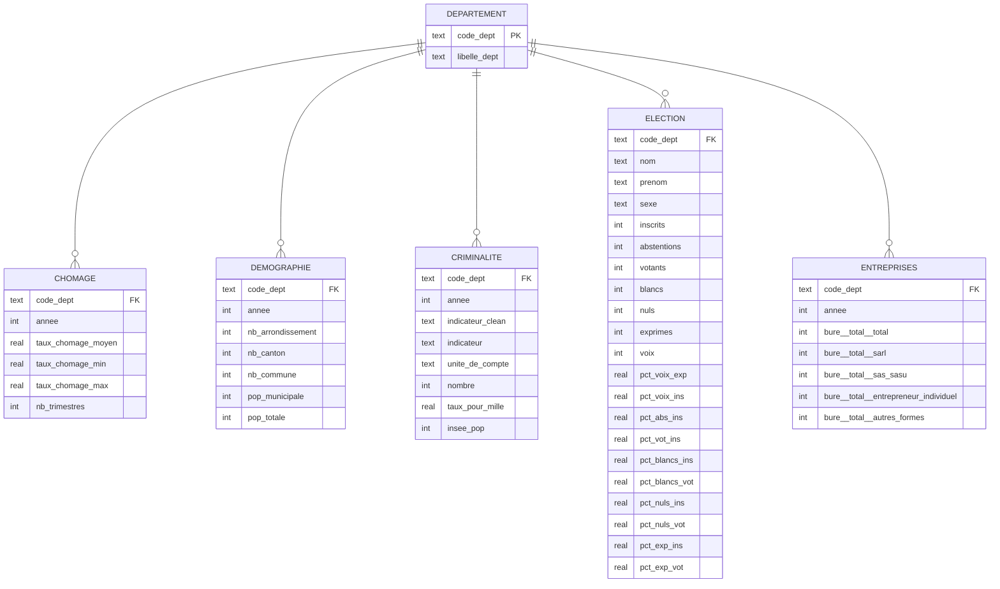

# MCD – MSPR TPRE813

```mermaid
erDiagram
    DEPARTEMENT {
        text code_dept PK
        text libelle_dept
    }

    CHOMAGE {
        text code_dept FK
        int annee
        real taux_chomage_moyen
        real taux_chomage_min
        real taux_chomage_max
        int nb_trimestres
    }

    DEMOGRAPHIE {
        text code_dept FK
        int annee
        int nb_arrondissement
        int nb_canton
        int nb_commune
        int pop_municipale
        int pop_totale
    }

    CRIMINALITE {
        text code_dept FK
        int annee
        text indicateur_clean
        text indicateur
        text unite_de_compte
        int nombre
        real taux_pour_mille
        int insee_pop
    }

    ELECTION {
        text code_dept FK
        text nom
        text prenom
        text sexe
        int inscrits
        int abstentions
        int votants
        int blancs
        int nuls
        int exprimes
        int voix
        real pct_voix_exp
        real pct_voix_ins
        real pct_abs_ins
        real pct_vot_ins
        real pct_blancs_ins
        real pct_blancs_vot
        real pct_nuls_ins
        real pct_nuls_vot
        real pct_exp_ins
        real pct_exp_vot
    }

    ENTREPRISES {
        text code_dept FK
        int annee
        int bure__total__total
        int bure__total__sarl
        int bure__total__sas_sasu
        int bure__total__entrepreneur_individuel
        int bure__total__autres_formes
    }

    DEPARTEMENT ||--o{ CHOMAGE : ""
    DEPARTEMENT ||--o{ DEMOGRAPHIE : ""
    DEPARTEMENT ||--o{ CRIMINALITE : ""
    DEPARTEMENT ||--o{ ELECTION : ""
    DEPARTEMENT ||--o{ ENTREPRISES : ""
```
